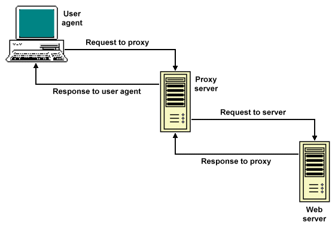

# smtp-strangler

This is an implementation of the
[Strangler Fig pattern](https://martinfowler.com/bliki/StranglerFigApplication.html)
for any SMTP server program that can run under
[inetd(8)](https://wiki.netbsd.org/guide/inetd/)
or
[tcpserver(1)](https://cr.yp.to/ucspi-tcp/tcpserver.html).

In this environment, client requests arrive on `stdin` and server
responses go to `stdout`.

`io_strangler.py` sits in the command chain just before the
server program. It passes requests to the server and returns responses
to the client. This is pretty boring. But since it's written in Python,
not idiosyncratic old C, it's pretty easy to start handling certain
requests in a new way.

Not exactly like this image (by Christopher J. Wells, [here](http://www.technologyuk.net/computing/website-development/world-wide-web/http.shtml)), but almost:

## Setup

### 0. Have macOS, Linux, or another Unix-like system

- The legacy code to be strangled is a Unix command-line program
- [Windows Subsystem for Linux](https://docs.microsoft.com/en-us/windows/wsl/install-win10) _might_ work; if you try, please let me know

### 1. Get the old C program to be strangled

     $ cd .../where/you/put/source/trees
     $ git clone https://github.com/schmonz/mess822
     $ cd mess822
     $ git checkout smtp-strangler
     $ make ofmipd

### 2. Get this Python Strangler Fig code

     $ cd .../where/you/put/source/trees
     $ git clone https://github.com/schmonz/smtp-strangler

### 3. Configure [PyCharm Community Edition](https://www.jetbrains.com/pycharm/download/)

- Python interpreter for this project: any 3.x or 2.7
- Right-click and run `tests.py`: it should run without errors, skipping all tests
- Right-click and run `io_strangler.py`
    - Run -> Edit Configurations -> Parameters needs to be `.../where/you/put/source/trees/mess822/ofmipd`
- Run `io_strangler.py` again and it should work interactively (try `HELP`, `WORD UP`, `QUIT`)
